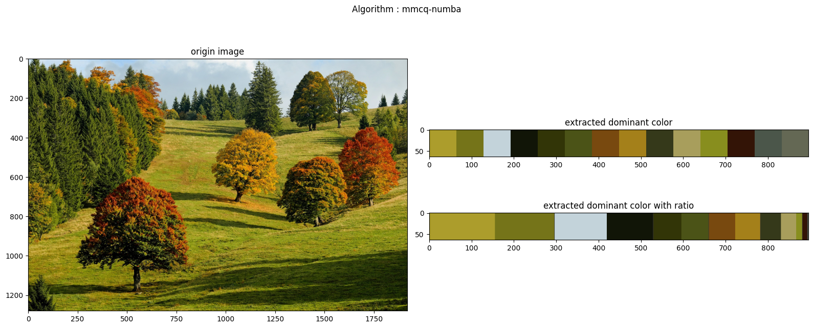

# mmcq_numba
Faster MMCQ algorithm ( analyze dominant colors in image) with numba in python



## Installation
``` pip install mmcq-numba ```

## Usage
```python
from mmcq_numba.quantize import mmcq

color_count = 8 # the number of dominant colors
quantize = 5 


path = <path to image>
rgb = cv2.cvtColor(cv2.imread(path),cv2.COLOR_BGR2RGB)
width,height,c = rgb.shape
rgb_resize = cv2.resize(rgb, (width//quantize, height//quantize))
width,height,c = rgb_resize.shape
colors = rgb_resize.reshape(width*height, c).astype(np.int64)
    
# input type must be 2d arrays((size, channels)), and dtype=np.int64
c_map = mmcq(colors, color_count)

```

## Reference
This project is based on [mmcq.py](https://github.com/kanghyojun/mmcq.py)